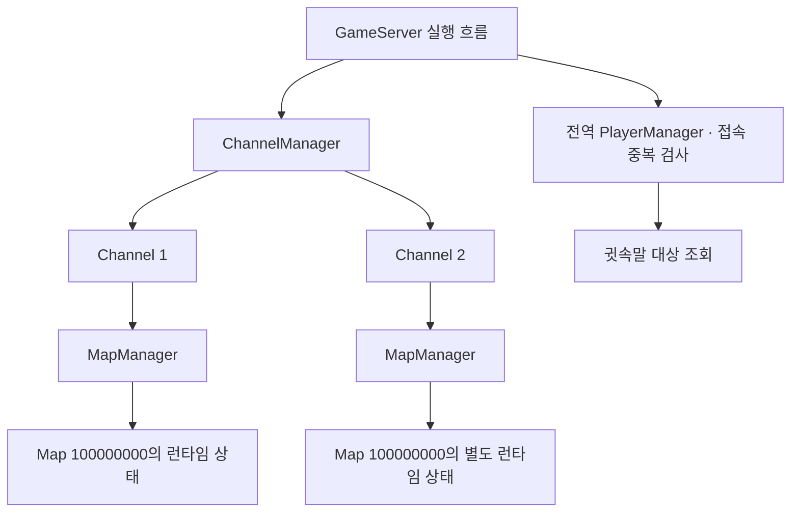

# Channel → Map과 실제 게임 UI 설계

2026-10-07 현재 코드를 기준으로 정리한 설계입니다. 이번 작업은 관리 경계와 전환 절차를 정의하며 Channel 런타임과 실제 UI 화면을 아직 구현하지 않습니다.

## 현재 구조와 관리 경계

GameServer는 PlayerManager 하나와 MapManager 하나를 사용합니다. PlayerManager는 계정·캐릭터 중복 등록을 막고 귓속말 대상을 조회합니다. MapManager는 Map과 기본 Monster를 생성하고 갱신합니다. Map은 소속 Player와 Monster, 물리 계산 및 Map-local 전파를 담당합니다.

Channel을 도입할 때 다음 경계를 유지합니다.

| 관리 주체 | 담당 범위 |
|---|---|
| GameServer | IOCP, DB 작업 완료, 전역 접속 검사와 Channel 갱신 순서 |
| ChannelManager | Channel 조회, 접속 가능 여부와 Channel 전환 |
| Channel | MapManager, 접속 인원, Channel 단위 공지·계측 |
| MapManager | 해당 Channel의 Map 생성·조회와 Map 갱신 |
| Map | Player·Monster 소속, 이동·전투 계산과 Map-local 패킷 전파 |
| 전역 PlayerManager | 서버 전체 계정·캐릭터 중복 접속 검사와 귓속말 조회 |

정적 지형 정의는 공유할 수 있지만 Player·Monster·드롭 아이템·respawn 타이머는 Channel별 Map 인스턴스에 둡니다. 같은 Map ID여도 Channel이 다르면 서로의 객체와 일반 채팅을 볼 수 없습니다. 처음에는 현재 IOCP 실행 흐름에서 모든 Channel을 순서대로 갱신해 상태 변경 순서를 보장합니다. Channel별 스레드는 부하 측정 이후 별도로 도입합니다.

## 식별자와 Channel 전환

런타임 위치는 `(Channel ID, Map ID)`로 식별합니다. 맵 입장 번호는 같은 Map 재입장과 Channel 이동마다 증가시킵니다. 입장 응답·맵 정보·지형·이동 입력과 상태에 Channel ID를 함께 추가하고 프로토콜 버전을 갱신합니다.

1. 접속 가능 Channel과 대상 Map, 인원 제한 및 이동 조건을 먼저 검사합니다.
2. 대상 Map 등록 가능 여부를 확보합니다. 계정·캐릭터의 전역 등록은 유지합니다.
3. 기존 Map에 퇴장을 알리고 Player를 제거합니다.
4. 대상 Map의 서버 spawn과 새 입장 번호를 적용합니다.
5. 전환 결과 → Map 정보 → 지형 완료 → 본인 상태 → 원격 객체 순서로 전달합니다.
6. 클라이언트는 이전 월드 객체와 입력 기록을 정리한 뒤 새 지형·초기 상태를 기다립니다.

처음에는 이 절차를 같은 서버 실행 흐름에서 완료해 중간에 다른 Map tick이 개입하지 않게 합니다. 대상 등록이 실패하면 기존 Map과 위치를 복구하고 실패 결과를 보냅니다. 송신 실패는 기존 연결 종료 예약 경로로 정리합니다. 전환을 위해 PlayerManager 등록을 해제하면 중복 접속이 허용될 수 있으므로 전역 등록을 유지합니다.

## 채팅과 귓속말 범위

- 일반 채팅: 같은 Channel의 같은 Map.
- 귓속말: 같은 GameServer의 전역 접속 등록을 사용해 다른 Channel·Map에서도 전달.
- Channel 공지: 해당 Channel의 접속자. Map의 브로드캐스트로 처리하지 않습니다.
- 서버 공지: 서버 전체 접속자.

계정별 채팅 제한은 전역 PlayerManager에 유지합니다. Channel 이동으로 허용량을 초기화하지 않습니다. 다른 GameServer 간 귓속말은 별도의 접속 위치 디렉터리·전달 서비스가 필요하며 첫 Channel 구현 범위에서 제외합니다.

## 실제 UI와 입력 책임

현재 TestClientController와 LoginScreenController는 IMGUI 테스트 도구입니다. 실제 UI는 다음 책임으로 나눕니다.

| 계층 | 역할 |
|---|---|
| GameFlowController | 연결·인증·선택·월드 로딩·입장 상태 전환과 이전 시도 무시 |
| LoginPresenter | ID·비밀번호 입력, 접속 결과와 재시도 표시 |
| CharacterSelectionPresenter | 캐릭터 목록과 선택 결과 표시 |
| ChatPresenter | 입력 포커스, ChatCommand 해석, 일반 채팅·귓속말·거절 알림 표시 |
| GameInputRouter | 채팅 포커스·창 활성·월드 준비 상태에 따른 게임 입력 허용 |
| NetworkManager·Protocol | 연결·패킷 송수신과 메인 스레드 이벤트 |
| WorldManager·PlayerView | Map 객체 생성·제거와 플레이어 표시 |
| MovementReconciliation | UI에 의존하지 않는 입력 기록·서버 확인·재실행 |

화면은 `Disconnected → ConnectingLogin → Authenticating → SelectingCharacter → ConnectingGame → LoadingMap → InGame` 상태에 따라 전환합니다. InGame 입력은 지형 완료와 본인 초기 상태를 모두 받은 뒤 활성화합니다. 맵 이동 중에는 다시 LoadingMap으로 전환합니다.

ChatPresenter가 포커스 상태를 GameInputRouter에 전달하도록 바꿔 실제 UI에서는 GUIUtility.keyboardControl에 의존하지 않게 합니다. 입력이 차단되면 중립 입력을 즉시 전송하고 짧은 점프 대기도 제거합니다. 로그인·입장 실패 시 상태와 입력을 정리하고 비밀번호는 성공 뒤 보관하지 않습니다. 최초 구현은 연결 종료 후 사용자가 다시 로그인하는 흐름을 유지합니다.

TestClientController의 자동 생성은 테스트 설정 또는 명시적 테스트 실행 옵션으로 제한합니다. 실제 UI와 테스트 bootstrap을 동시에 생성하지 않습니다. 임의 Map ID 변경 패널은 테스트 모드에 남기고 실제 게임은 서버가 검증하는 포탈 요청으로 이동합니다.

## 첫 구현 묶음과 검증 기준

Channel 런타임은 한 GameServer 안의 두 Channel부터 구현합니다. 같은 Map ID의 Player·Monster·채팅 격리, Channel 전환의 이전 입력 거절, 전역 중복 접속 검사와 Channel 간 귓속말을 검증합니다.

실제 UI는 입력 라우터 분리 → 로그인·캐릭터 선택 → 월드 로딩 → HUD·채팅 순서로 연결합니다. 클릭 없는 연속 채팅, 포커스 중 이동 정지, 창 비활성 중립 입력, 연결 실패 재시도와 늦은 응답 무시를 현재 통합 테스트에 이어 검증합니다.
